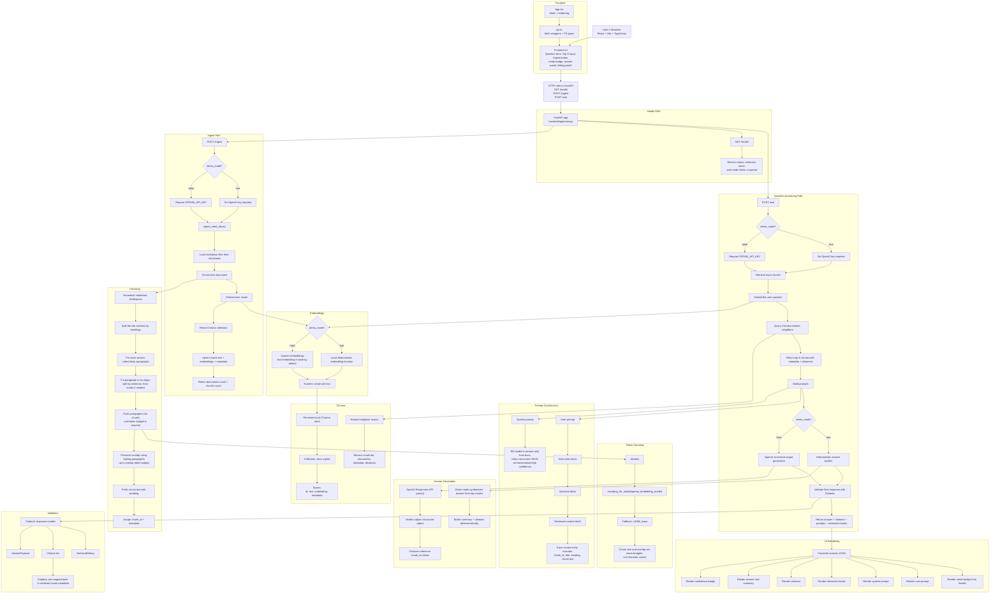

# RAG Docs Copilot Demo

Small full-stack RAG demo built with:
- FastAPI
- React + Vite + TypeScript
- Chroma
- OpenAI
- Pydantic

This repo supports two execution modes:
- `demo` mode: fully local deterministic embeddings and deterministic answer synthesis for free demos
- `openai` mode: OpenAI embeddings plus structured generation

## What This App Demonstrates

This app demonstrates the core RAG loop:

1. Ingest markdown docs
2. Chunk docs into semantically meaningful sections
3. Embed chunks into vectors
4. Store vectors in Chroma
5. Embed a user question
6. Retrieve top-k nearest chunks
7. Assemble a grounded prompt
8. Generate a structured answer
9. Validate the output
10. Render answer, citations, retrieved chunks, and debug info

## Architecture Diagram



## End-To-End Flow

```text
[1] User opens the app
    |
    +--> Frontend calls GET /health
          |
          +--> Backend returns:
               - status
               - Chroma collection name
               - mode = "demo" or "openai"
          |
          +--> UI shows mode badge

[2] User clicks "Ingest Seed Docs"
    |
    +--> Frontend POST /ingest
          |
          +--> Backend loads markdown files from docs/seed/
          |
          +--> Each file is chunked:
               - split by markdown headings
               - split section bodies into paragraphs
               - use true token counts via tiktoken
               - create overlapping token-bounded chunks
               - avoid heading-only fragments
          |
          +--> Each chunk is embedded:
               - demo mode: local deterministic vector
               - openai mode: embedding API
          |
          +--> Backend recreates the Chroma collection
          |
          +--> Chroma stores:
               - chunk id
               - chunk text
               - vector embedding
               - metadata:
                 - document id
                 - source path
                 - title
                 - heading
          |
          +--> Backend returns document/chunk counts
          |
          +--> UI shows ingest success banner

[3] User asks a question
    |
    +--> Frontend POST /ask with:
          - question
          - top_k
    |
    +--> Backend embeds the question
          |
          +--> same embedding strategy as ingest
    |
    +--> Backend queries Chroma:
          - nearest-neighbor search
          - returns top-k chunks
          - includes distances
    |
    +--> Backend builds prompts:
          - System prompt:
            "answer from docs only, structured JSON, confidence label"
          - User prompt:
            - instruction block
            - question block
            - retrieved context block
            - each context block includes chunk_id/title/heading/content
    |
    +--> Answer generation:
          - demo mode:
            deterministic summary from retrieved chunks
          - openai mode:
            model generates structured JSON
    |
    +--> Backend validates output with Pydantic
          |
          +--> ensures response schema is stable
          +--> citations match retrieved chunk ids
    |
    +--> Backend returns:
          - answer
          - summary
          - citations
          - confidence
          - retrieved chunks
          - system prompt
          - user prompt
    |
    +--> Frontend renders:
          - answer panel
          - citations
          - retrieved chunks
          - full prompt debug blocks
```

## Visual Retrieval Model

```text
Seed docs
  |
  v
[Chunk 1] --embed--> [vector 1] \
[Chunk 2] --embed--> [vector 2]  \
[Chunk 3] --embed--> [vector 3]   > stored in Chroma
[Chunk 4] --embed--> [vector 4]  /
                                /
User question
  |
  +--embed--> [query vector]
                  |
                  v
        Chroma nearest-neighbor search
                  |
                  v
      top-k most similar chunk vectors
                  |
                  v
      corresponding chunk texts + metadata
```

## Prompt Structure

The app now exposes both prompt layers in the UI.

### System Prompt

Controls model behavior:
- answer questions about local markdown docs
- return structured JSON
- use only supplied context
- set `low`, `medium`, or `high` confidence

### User Prompt

Contains:
- task instructions
- the user question
- the retrieved chunks

Conceptually:

```text
SYSTEM:
You answer questions about local markdown docs.
Produce structured JSON matching the schema.
Use only the supplied context.
Set confidence to low, medium, or high.

USER:
Use only the retrieved context to answer the question.
If the context is insufficient, say so explicitly.
Return citations only for chunks that directly support the answer.

Question:
<user question>

Retrieved context:
[chunk_id=... ] title=... | heading=...
<chunk text>
```

## Modes

### Demo Mode

Enabled by setting:

```env
DEMO_MODE=true
```

Behavior:
- no OpenAI key required
- embeddings are local and deterministic
- answer generation is deterministic
- Chroma vector retrieval is still real

This is good for:
- free demos
- architecture walkthroughs
- UI/debug demonstrations

### OpenAI Mode

Enabled by setting:

```env
DEMO_MODE=false
OPENAI_API_KEY=...
```

Behavior:
- chunk embeddings use OpenAI
- answer generation uses OpenAI structured output parsing

This is the stronger demonstration of actual generation quality.

## Confidence And Scores

### Confidence

The `confidence` label is answer-level confidence, not retrieval distance.

- in `openai` mode: the model sets it
- in `demo` mode: it is assigned deterministically

### Chunk Score

The chunk `score` shown in the UI is Chroma distance.

Important:
- lower is better
- it is not a probability
- it is not answer confidence

## Top K

`Top K` is the number of chunks retrieved for a question.

Effects:
- lower `k`: smaller context, lower cost, less noise
- higher `k`: more coverage, larger context, potentially more noise

Current default:
- `4`

## Running The App

### Backend

```bash
cd /Users/jasoneggert/misc/docCopilot
./.venv/bin/python -m uvicorn app.main:app --app-dir backend --host 127.0.0.1 --port 8000
```

### Frontend

```bash
cd /Users/jasoneggert/misc/docCopilot/frontend
npm run dev
```

Open:
- <http://127.0.0.1:5173>

## Demo Flow

1. Open the app
2. Confirm the mode badge says `demo` or `openai`
3. Click `Ingest Seed Docs`
4. Ask a question
5. Walk through:
   - answer
   - citations
   - retrieved chunks
   - system prompt
   - user prompt

## Good Demo Questions

- `What should a RAG UI show to help developers understand why an answer was generated?`
- `How should structured JSON answers be validated before the frontend renders them?`
- `What error response behavior do the docs recommend for validation errors versus server errors?`
- `How does retrieval-augmented generation work in this demo?`
- `What should citations contain in the UI?`

## Repo Notes

The repo intentionally ignores local and generated files such as:
- `.env`
- `.venv/`
- `.pycache/`
- `.chroma/`
- `frontend/node_modules/`
- `frontend/dist/`

This keeps the committed history focused on source code and configuration templates.
